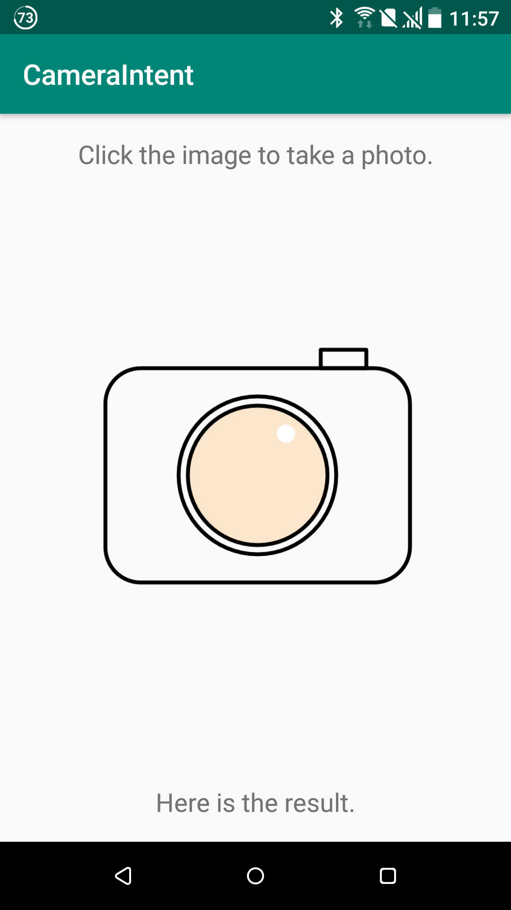
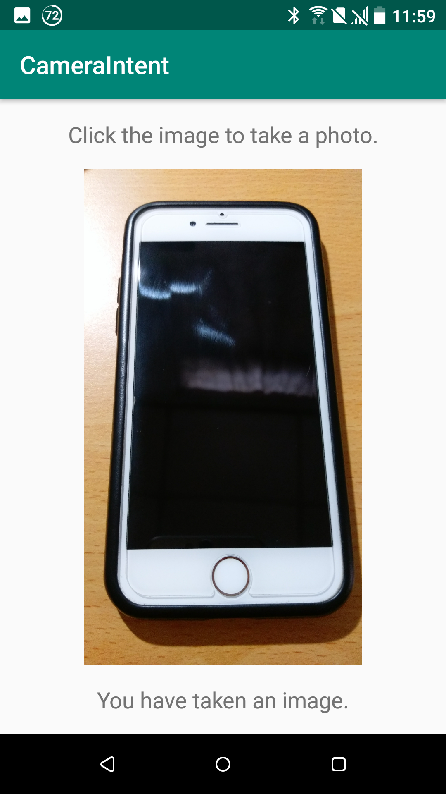

# Using Camera via Intent on Android

The repository is an example, a template as well, using the intent to take a photo from a built-in digital camera. The following are examples.

| Homepage (Before) | Result (After) |
| ----------------- | -------------- |
|  |  |

